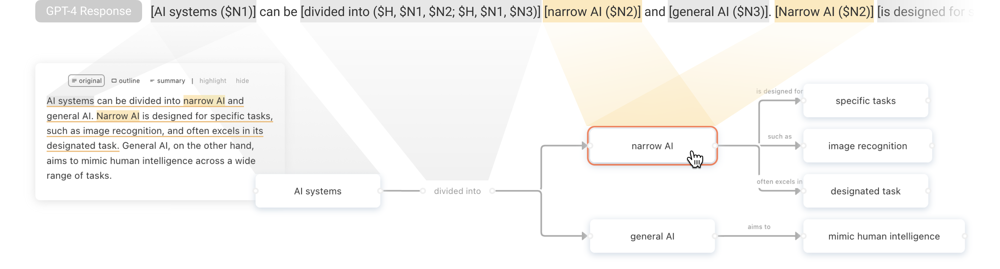

# </img>raphologue: Exploring LLM Responses with Interactive Diagrams

Graphologue transforms Large Language Model (LLM, such as GPT-4) responses into interactive diagrams in real-time with _Inline Annotation_.



[**Live Demo**](https://graphologue.app/) (An OpenAI API key is needed.) | [**UIST 2023 Paper**](https://doi.org/10.1145/3586183.3606737) | [**Website**](https://creativity.ucsd.edu/)

## Development

1. Install all the dependencies.

```bash
npm install
```

2. Create an `.env` file at the project ROOT, where you need to put the OpenAI API key. The file should look like:

```
REACT_APP_OPENAI_API_KEY=sk-...
```

3. Start the local server.

```bash
npm start
```

## UIST 2023 Paper

**Graphologue: Exploring Large Language Model Responses with Interactive Diagrams**<br />
Peiling Jiang*, Jude Rayan*, Steven P. Dow, Haijun Xia _(\* Both authors contributed equally to this research.)_

**Please cite this paper if you used the code or prompts in this repository.**

> Peiling Jiang, Jude Rayan, Steven P. Dow, and Haijun Xia. 2023. Graphologue: Exploring Large Language Model Responses with Interactive Diagrams. In The 36th Annual ACM Symposium on User Interface Software and Technology (UIST ’23), October 29-November 1, 2023, San Francisco, CA, USA. ACM, New York, NY, USA, 20 pages. https://doi.org/10.1145/3586183.3606737

```bibtex
@inproceedings{jiang2023graphologue,
  author = {Jiang, Peiling and Rayan, Jude and Dow, Steven P. and Xia, Haijun},
  title = {Graphologue: Exploring Large Language Model Responses with Interactive Diagrams},
  year = {2023},
  isbn = {9798400701320},
  publisher = {Association for Computing Machinery},
  address = {New York, NY, USA},
  url = {https://doi.org/10.1145/3586183.3606737},
  doi = {10.1145/3586183.3606737},
  booktitle = {The 36th Annual ACM Symposium on User Interface Software and Technology},
  keywords = {Large Language Model, Natural Language Interface, Visualization},
  location = {San Francisco, CA, USA},
  series = {UIST '23}
}
```

Large language models (LLMs) have recently soared in popularity due to their ease of access and the unprecedented ability to synthesize text responses to diverse user questions. However, LLMs like ChatGPT present significant limitations in supporting complex information tasks due to the insufficient affordances of the text-based medium and linear conversational structure. Through a formative study with ten participants, we found that LLM interfaces often present long-winded responses, making it difficult for people to quickly comprehend and interact flexibly with various pieces of information, particularly during more complex tasks. We present Graphologue, an interactive system that converts text-based responses from LLMs into graphical diagrams to facilitate information-seeking and question-answering tasks. Graphologue employs novel prompting strategies and interface designs to extract entities and relationships from LLM responses and constructs node-link diagrams in real-time. Further, users can interact with the diagrams to flexibly adjust the graphical presentation and to submit context-specific prompts to obtain more information. Utilizing diagrams, Graphologue enables graphical, non-linear dialogues between humans and LLMs, facilitating information exploration, organization, and comprehension.

## Acknowledgements

This work would not be possible without the selfless and heartwarming support of all the members of the Creativity Lab at UC San Diego. Our deepest gratitude extends to Fuling Sun, who was crucial in facilitating a productive drive toward the successful completion of this project. We would also like to thank Sangho Suh, Bryan Min, Matthew Beaudouin-Lafon, and Jane E for helping with the video figure production, and William Duan, Vidya Madhavan, Tony Meng, Xiaoshuo Yao, and Juliet (Lingye) Zhuang for assistance with the technical evaluation, as well as Brian Hempel and Devamardeep Hayatpur for proofreading the paper draft. We thank anonymous reviewers for their constructive and insightful reviews. NSF grant #2009003 provided financial support.
